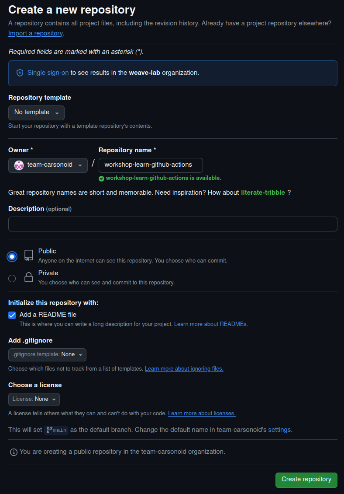
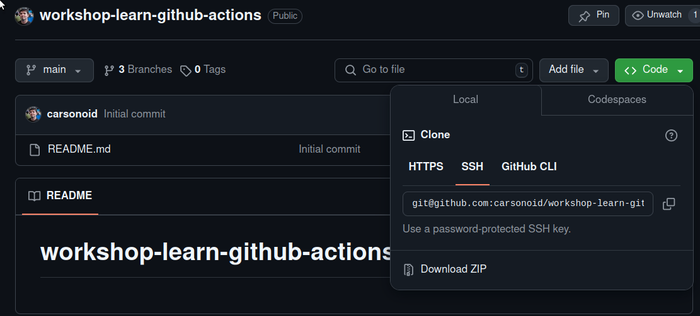
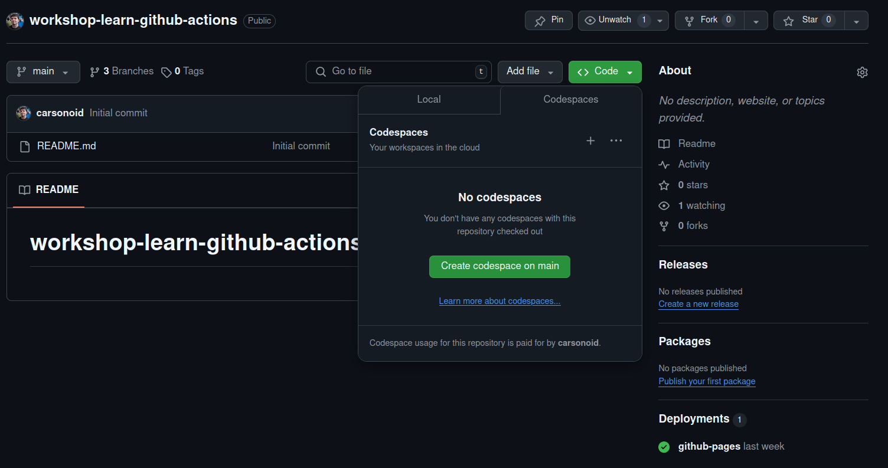
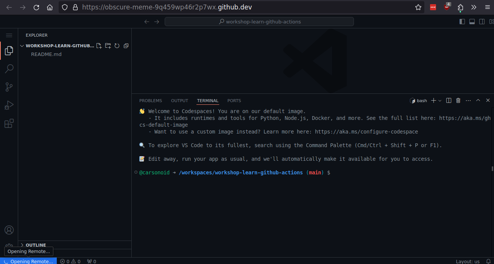
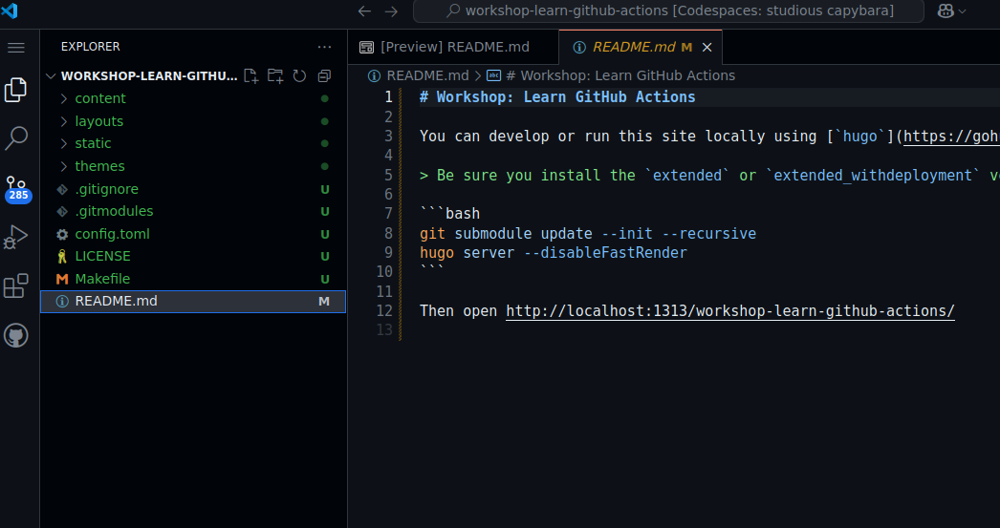

# Step 1: Create the Repository





<--->

First, you will need to create a new repository on GitHub. This repository will be used to store the code for the workshop and will
be the repository which will run all the GitHub Actions and Workflows.

We are going to make a new repository using the GitHub web interface.




## If you want to follow along: do not fork

For the purposes of this workshop, start from a completely empty repository. While forking is normally fine, doing so will make
it impossible to follow along in the workshop as it is designed.





## Instructions


Open up the <a href="https://github.com/new" target="_blank">New Repository Page</a> and fill it out with these suggested settings:

* Template: `No Template`
  * This field may not exist for some users.
* Owner: `Your GitHub User`
* Name: `workshop-learn-github-actions`
  * This can be the same for everyone since it is namespaced under your user
* Visibility: `Public`
  * GitHub Actions are available to *both* public and private repositories, Each repository gets a number of free "minutes" of action time per month.
  * But, we will be using GitHub Pages to serve the static assets, which will require the repository to be public.
* Check the "Add a README file" box

Everything else can be left unchecked. We will be bootstrapping the contents of the repo in a later step





## Launch a codespace session for the repository


1. Open the repository in GitHub
2. Click the `Code` button
  
1. Click the "Codespaces tab"
2. Click "Create codespace on main"
  
3. Wait for the page to load



## Bootstrap The Repository Contents


Use the terminal to download and extract the assets for the workshop

```bash
curl  | tar -zxv
```
* Alternatively, you can [click here download the assets]() then right click in the file explorer and choose "Upload", then run `tar -zxvf workshop-assets.tgz`

Once you are done you should see a lot of new files your your workspace.





## Run the site live


The default codespace image comes with `hugo` pre-installed, but it does not have some features required by this site, so we need to install the extended edition:

```bash
curl -L https://github.com/gohugoio/hugo/releases/download/v0.145.0/hugo_extended_0.145.0_linux-amd64.tar.gz | tar -zxv hugo
```

Then run the version we installed:

```bash
./hugo server
```


### False 404!

Codespaces is going to pop up a prompt to automatically forward you to the running server.

You *will* get a 404 by default. This is because you need to access the site under a base url
instead of `/workshop-learn-github-actions`

You must manually add the url base for the proxy to work!



Sample output

```txt
@carsonoid ➜ /workspaces/workshop-learn-github-actions (main) $ hugo server
Watching for changes in /workspaces/workshop-learn-github-actions/{content,data,layouts,static,themes}
Watching for config changes in /workspaces/workshop-learn-github-actions/config.toml
Start building sites … 
hugo v0.124.1-db083b05f16c945fec04f745f0ca8640560cf1ec linux/amd64 BuildDate=2024-03-20T11:40:10Z VendorInfo=gohugoio


                   | EN  
-------------------+-----
  Pages            | 18  
  Paginator pages  |  0  
  Non-page files   |  3  
  Static files     | 78  
  Processed images |  0  
  Aliases          |  2  
  Cleaned          |  0  

Built in 52 ms
Environment: "development"
Serving pages from disk
Running in Fast Render Mode. For full rebuilds on change: hugo server --disableFastRender
Web Server is available at //localhost:1313/workshop-learn-github-actions/ (bind address 127.0.0.1) 
Press Ctrl+C to stop
```



### Fun: Add yourself to the authors


Make your mark! Open up the `config.toml` and add a new line to the `authors` section:

```toml
[params]
  # Add a name or alias to this list as you go through the workshop.
  Authors = [
    "Carson Anderson"
  ]
```

```toml
[params]
  # Add a name or alias to this list as you go through the workshop.
  Authors = [
    "Carson Anderson",
    "Tami R"
  ]
```

Then navigate to the "Credits" page on your proxy page and see that `hugo` has automatically rebuilt the site and you are now
an author in the workshop chain!



## Build the site


Running `hugo server` builds the site for local viewing, but it does not build production-ready assets. To do that, simply run `hugo` without any arguments.

```bash
./hugo
```

```txt
@carsonoid ➜ /workspaces/workshop-learn-github-actions (main) $ hugo
Start building sites … 
hugo v0.124.1-db083b05f16c945fec04f745f0ca8640560cf1ec linux/amd64 BuildDate=2024-03-20T11:40:10Z VendorInfo=gohugoio


                   | EN  
-------------------+-----
  Pages            | 18  
  Paginator pages  |  0  
  Non-page files   |  3  
  Static files     | 78  
  Processed images |  0  
  Aliases          |  2  
  Cleaned          |  0  

Total in 101 ms
```

Success! Now we have a `public` directory inside the codespace that contains all the static web assets needed to serve our site.


