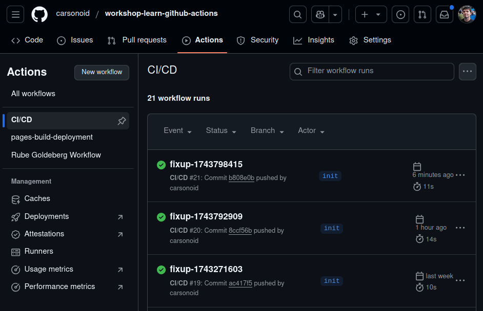
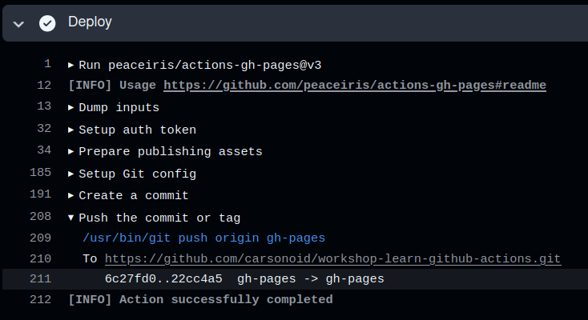
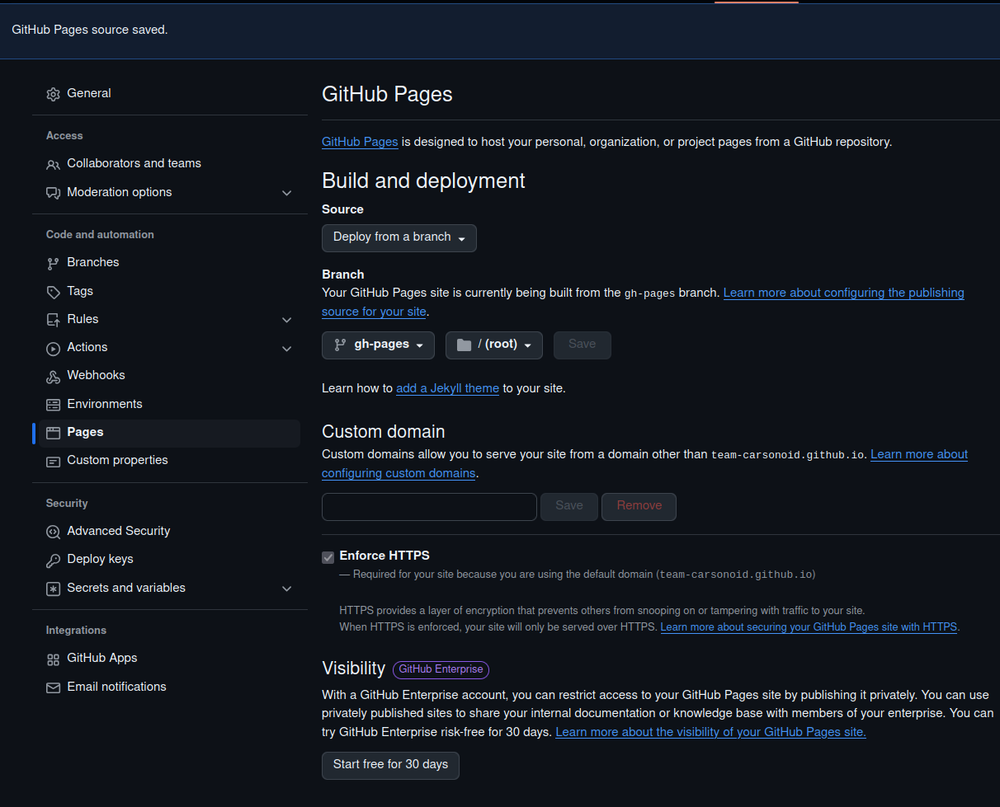
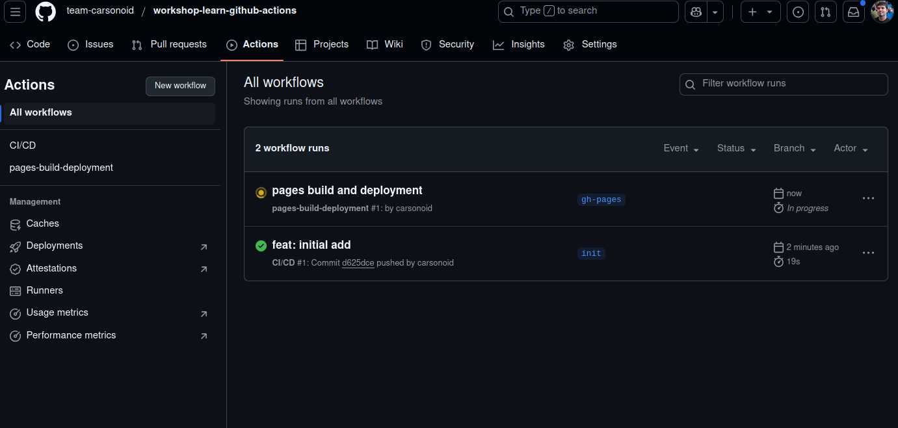
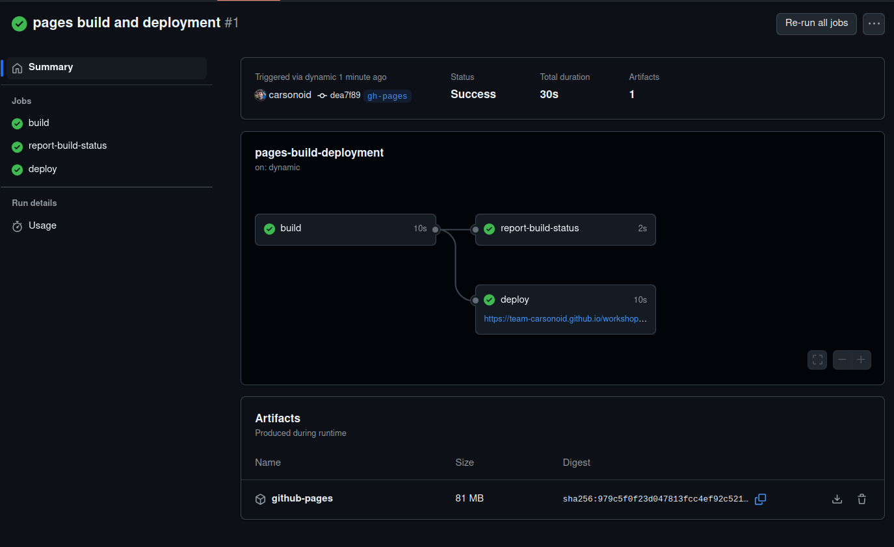

# First Workflow





<--->

Once you have the bootstrapped repository and workshop content from the [Create Repo Page]() you are ready
to create your first GitHub Actions Workflow!

The general overview of this workflow:

* Run on push to the repository
* Contains a single job which should
  * Clone the repo
  * Install `hugo`
  * Build the site
  * (sometimes) Publish the site to GitHub Pages


There are many, many more fields that are valid for workflows, jobs, and steps then we will
cover here. [See the docs for all the options](https://docs.github.com/en/actions/writing-workflows/workflow-syntax-for-github-actions)





## Create the workflow


Defining a workflow with GitHub actions is easy as making a file! Do the following
inside your code space:

```bash
mkdir -p .github/workflows
touch .github/workflows/cicd.yaml
```

Or

Right Click in the explorer and click "New File" and type `.github/workflows/cicd.yaml`


**The folder names matter**

The file name for a workflow file can by anything. But it *must* be in a directory at the root of the repo
that exactly matches the name `.github/workflows` for the file to be discovered.





### Add the workflow name and trigger


Here is the start to our new workflow:

```yaml
name: CI/CD

on: push
```

---

* The [name field](https://docs.github.com/en/actions/writing-workflows/workflow-syntax-for-github-actions#name) is optional and can be whatever you want. But it will be used in the GitHub UI in many places so a short human-friendly name is best.
* The [on field](https://docs.github.com/en/actions/writing-workflows/workflow-syntax-for-github-actions#on) is where you define the conditions under which your workflow runs.
  * We will just use `on: push` to have the workflow trigger whenver *any* commits or tags are pushed.
* The `jobs` field is where all jobs are defined, it is empty for now but we will add the first job in the next step



### Add the build job


```yaml
name: CI/CD

on: push

jobs:
  build-site:
    name: Build Site
    runs-on: ubuntu-latest
    permissions:
      contents: write
    steps: # TODO:
```

---

The `jobs` field of the workflow is a `map` of job ids to job descriptions. We have
defined a single job with the `id` of `build`

* The [name](https://docs.github.com/en/actions/writing-workflows/workflow-syntax-for-github-actions#jobsjob_idname) field is used to give our job a more human-readable name
* The [runs-on](https://docs.github.com/en/actions/writing-workflows/workflow-syntax-for-github-actions#jobsjob_idruns-on) field is required. It tells the actions information
  about the kind of runner the job needs.
    * We are using `ubuntu-20.04` which is a [GitHub Hosted Runner](https://docs.github.com/en/actions/writing-workflows/workflow-syntax-for-github-actions). There are many other kinds of runner, including custom runners (not covered in this workshop)
* The [permissions](https://docs.github.com/en/actions/writing-workflows/workflow-syntax-for-github-actions#permissions) field defines custom permissions this workflow will need on our repo.
  * This field is optional and the default is normally only `contents: write`. This workflow is going to need to push the static site content to a branch of the repository, so we need to give it extra permissions.
* The `steps` field is empty for now, but we will put all our job steps there in the next section.



### Add the checkout step


```yaml
name: CI/CD

on: push

jobs:
  build-site:
    name: Build Site
    runs-on: ubuntu-latest
    permissions:
      contents: write
    steps:
      - name: Checkout
        uses: actions/checkout@v3
        with:
          submodules: true
          fetch-depth: 0

```

---

Remember: Each job starts with an empty workspace. So, if we want to build
our static web site from the workshop code, we need to first clone the repository
from GitHub.

We can do this with the `actions/checkout` action which is an offical action [provided and maintained by GitHub directly](https://github.com/actions/checkout).
You can see all other available `with` options in the repo or [marketplace page](https://github.com/marketplace/actions/checkout).

Things to note about this action:

1. It references a github repository by name using the `uses` field
   * It is pinned to a specific tag in the  by using the `@` sign in the action names. This is required, GitHub actions does not have an automatic "latest" tag for actions. (this is a good thing!)
   * We will go over other ways to reference actions in the [deep dive on Actions](/workshop/4-actions/)
2. We use  the `submodules: true` to tell the action to automatically sync the "theme" submodule.
3. We use `fetch-depth: 0` to tell the action to not clone the entire git history, just the latest files.



### Add the hugo install step


Our next step leverages a community provided action. These work the same way as official GitHub Actions. This action
encapsulates installing hugo into the runner so it is available to later steps.

Again, note how we are using `with` to customize the behavior of the action. Available inputs to this action are
documented in the [repo for the action](https://github.com/peaceiris/actions-hugo) which is also surfaced in the
[GitHub Actions Marketplace](https://github.com/marketplace/actions/hugo-setup)


# Be Careful!

While it is common to use community actions, be aware that you are effectively running 3rd party
code in the runner. That code will have access to any repository secrets, runtime environments, and
files that you have set up in the job.

Best-practice is to fully vet the code before using it. Just as you would with 3rd party dependencies in your code base.


```yaml
name: CI/CD

on: push

jobs:
  build-site:
    name: Build Site
    runs-on: ubuntu-latest
    permissions:
      contents: write
    steps:
      - name: Checkout
        uses: actions/checkout@v3
        with:
          submodules: true
          fetch-depth: 0

      - name: Setup Hugo
        uses: peaceiris/actions-hugo@v3
        with:
          hugo-version: 'latest'
          extended: true
```



### Add the build step


```yaml
name: CI/CD

on: push

jobs:
  build-site:
    name: Build Site
    runs-on: ubuntu-latest
    permissions:
      contents: write
    steps:
      - name: Checkout
        uses: actions/checkout@v3
        with:
          submodules: true
          fetch-depth: 0

      - name: Setup Hugo
        uses: peaceiris/actions-hugo@v3
        with:
          hugo-version: 'latest'
          extended: true

      - name: Build
        run: |
          # make the assets tgz users need to bootstrap the workshop
          make workshop-assets

          # there is no built-in env variable for the repo name without owner, so we have to parse it out
          REPO_NAME=$(echo "${GITHUB_REPOSITORY}" | cut -d'/' -f2)
          hugo --minify -b "https://${GITHUB_REPOSITORY_OWNER}.github.io/$REPO_NAME/"

```



### Add the deploy step


```yaml
name: CI/CD

on: push

jobs:
  build-site:
    name: Build Site
    runs-on: ubuntu-latest
    permissions:
      contents: write
    steps:
      - name: Checkout
        uses: actions/checkout@v3
        with:
          submodules: true
          fetch-depth: 0

      - name: Setup Hugo
        uses: peaceiris/actions-hugo@v3
        with:
          hugo-version: 'latest'
          extended: true

      - name: Build
        run: |
          # make the assets tgz users need to bootstrap the workshop
          make workshop-assets

          # there is no built-in env variable for the repo name without owner, so we have to parse it out
          REPO_NAME=$(echo "${GITHUB_REPOSITORY}" | cut -d'/' -f2)
          hugo --minify -b "https://${GITHUB_REPOSITORY_OWNER}.github.io/$REPO_NAME/"

      - name: Deploy
        if: github.ref == 'refs/heads/main' || github.ref == 'refs/heads/init'
        uses: peaceiris/actions-gh-pages@v3
        with:
          github_token: ${{ secrets.GITHUB_TOKEN }}
          publish_dir: ./public
```



### Full final workflow yaml


```yaml
name: CI/CD

on: push

jobs:
  build-site:
    name: Build Site
    runs-on: ubuntu-latest
    permissions:
      contents: write
    steps:
      - name: Checkout
        uses: actions/checkout@v3
        with:
          submodules: true
          fetch-depth: 0

      - name: Setup Hugo
        uses: peaceiris/actions-hugo@v3
        with:
          hugo-version: 'latest'
          extended: true

      - name: Build
        run: |
          # make the assets tgz users need to bootstrap the workshop
          make workshop-assets

          # there is no built-in env variable for the repo name without owner, so we have to parse it out
          REPO_NAME=$(echo "${GITHUB_REPOSITORY}" | cut -d'/' -f2)
          hugo --minify -b "https://${GITHUB_REPOSITORY_OWNER}.github.io/$REPO_NAME/"

      - name: Deploy
        if: github.ref == 'refs/heads/main' || github.ref == 'refs/heads/init'
        uses: peaceiris/actions-gh-pages@v3
        with:
          github_token: ${{ secrets.GITHUB_TOKEN }}
          publish_dir: ./public
```




## Now run it!


Because our workflow is set up to trigger on `push` all we have to do to kick it off
is to simply create a new commit and `push` it to GitHub.

```shell
git checkout -b init
git add .
git commit -m "feat: initial add"
git push -u origin HEAD
```

Ok... now what? We pushed the update but how do we know if it is working?



## Watching a workflow



Luckily, GitHub provides a very useful UI to help us track workflows and check
the status of the jobs. It can be found under the `Actions` tab on the repository's
GitHub page.





## Check for the deploy workflow


If everything went well, then you should be able to refresh the `Actions` tab
and see a second workflow that was automatically triggered by the push to the `gh-pages`
branch that was done by `peaceiris/actions-gh-pages@v3`




> Take some time to click around in the actions UI there is a lot of information and other features
> of the platform surfaced on this page.



## Enable GitHub Pages


1. Click on the "Settings" tab
2. Click on "Pages"
3. Under "branch" choose the `gh-pages` branch that was created by the `Publish` step
4. Click "Save"



Now navigate back to the "Actions" tab and you should see a new workflow



If you click on it you will see a good example of a more complicated workflow with multiple nested
jobs. This is what GitHub uses to actually process pushes to the pages branch to their serving infrastructure.




