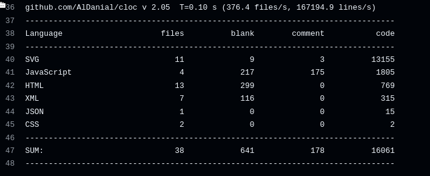

# Actions





<--->

At this point you should have public web page for the workshop built off your repository and
hosted under your GitHub handle. This section of the workshop contains a deep dive on Actions.

- Break down the actions currently in the `CI/CD` workflow and job.
- Guide you through two kinds of custom actions you can use to enhance your current workflow.




## Reminder: Set up the fixup alias


To make life easier when we iterate on the workflows later paste this into your terminal.

```sh
alias fixup='git add -A; git commit -m "fixup-$(date "+%Y%m%dT%H%M%S")"; git push'
```



## Expressions


GitHub Actions have access to [expressions](https://docs.github.com/en/actions/writing-workflows/choosing-what-your-workflow-does/evaluate-expressions-in-workflows-and-actions)
which allows you extract data and use logic inside the yaml.

You can identify expressions in a yaml with the `${{ }}` notation. Expressions can be used in many different places in the yaml.

```yaml
if: ${{ github.event_name == 'push' }}
env:
  MY_ENV_VAR: ${{ <expression> }}
  TIMEOUT_SECONDS: ${{ fromJSON(env.time) }}
run: |
  if [ "${{ github.repository }}" == "my-org/my-repo" ]; then
    echo "This is a push event for my repo: $MY_ENV_VAR"
  fi
  curl -m $TIMEOUT_SECONDS https://example.com
```


Heads up!

While you can use expressions in *many* locations in the yaml, they are not universally supported.

For example, you can't use expressions to generate the yaml itself.

```yaml
# invalid 👇
env: ${{ fromJSON(env) }}
```




## Metadata


### [Environment Variables](https://docs.github.com/en/actions/writing-workflows/choosing-what-your-workflow-does/store-information-in-variables#default-environment-variables)

Actions and all code executing within the context of an action can make use of the many default environment variables.

```yaml
name: Print
run: echo "Running job for repo: ${GITHUB_REPOSITORY}"
```

### [Contexts](https://docs.github.com/en/actions/writing-workflows/choosing-what-your-workflow-does/accessing-contextual-information-about-workflow-runs)

There is often runtime metadata that you need to make use of within your workflow or action's `yaml`.

Actions have access to most of the contexts depending on the specific workflow and job run conditions. Contexts typically have much
more accessible data then `Environment Variables`. But thanks the the `env` section of actions and workflows you can export *any* context data as an environment variable
even if that data is not included in [the defaults](https://docs.github.com/en/actions/writing-workflows/choosing-what-your-workflow-does/accessing-contextual-information-about-workflow-runs)

```yaml
name: Print Sometimes
if: "${{ job.status == 'success'" }}
env:
  JOB_STATUS: ${{job.status}} 
run: echo "Running job for repo: ${GITHUB_REPOSITORY}"
```

#### [Outputs](https://docs.github.com/en/actions/writing-workflows/choosing-what-your-workflow-does/passing-information-between-jobs)

Actions of any kind can support `outputs`. The outputs available are typically documented
in the README.md of the action. To use an action's output you need to give it an `id` and use the [`steps` context](https://docs.github.com/en/actions/writing-workflows/choosing-what-your-workflow-does/accessing-contextual-information-about-workflow-runs#steps-context)

```yaml
  - name: Get an entry with a variable that might contain dots or spaces
    id: username
    uses: mikefarah/yq@master
    with:
      cmd: yq '.user.name' service.yaml
  - name: Reuse a variable obtained in another step
    run: echo ${{ steps.username.outputs.result }}
```



## Current Actions


The `CI/CD` job currently has two kinds of actions defined

* [3rd Party Actions](https://docs.github.com/en/actions/writing-workflows/choosing-what-your-workflow-does/using-pre-written-building-blocks-in-your-workflow#overview)
* [Script Actions](https://docs.github.com/en/actions/writing-workflows/choosing-what-your-workflow-does/adding-scripts-to-your-workflow)




### 3rd Party Actions


[3rd Party Actions](https://docs.github.com/en/actions/writing-workflows/choosing-what-your-workflow-does/using-pre-written-building-blocks-in-your-workflow#overview) are actions that are defined in other GitHub Repositories. They encapsulate a
specific behavior or step and can often be very complex behind the scenes.

```yaml
- name: Checkout
  uses: actions/checkout@v3
  with:
    submodules: true
    fetch-depth: 0
```



#### Advanced Usage - Pinning


There are a lot of nuanced ways you can invoke 3rd party actions. The `uses` directive supports
multiple kinds of reference

```yaml
# by tag
uses: actions/checkout@v3

# by branch
uses: actions/checkout@beta

# by commit hash (most secure)
uses: actions/checkout@85e6279cec87321a52edac9c87bce653a07cf6c2
```



### Script Actions


[Script Actions](https://docs.github.com/en/actions/writing-workflows/choosing-what-your-workflow-does/adding-scripts-to-your-workflow) are actions that are defined entirely in the workflow step itself. They run using the default shell of the runner
unless `shell` is specified.

```yaml
name: Build
run: go build .
```

It is also common to use yaml multiline strings to put relatively long scripts into the action directly.

```yaml
name: Build
run: |
  # there is no built-in env variable for the repo name without owner, so we have to parse it out
  REPO_NAME=$(echo "${GITHUB_REPOSITORY}" | cut -d'/' -f2)
  hugo --minify -b "https://${GITHUB_REPOSITORY_OWNER}.github.io/$REPO_NAME/"
```

These kinds of actions are infinitely flexible but can be highly dependent on the runner and workflow environment.
Shell scripting is also has a lot of potential pitfalls and easy mistakes that can be made.

Never the less, it is a very common kind of action to use and is often "just enough" to get work done while incurring almost
no overhead.




## New Actions


There are two more types of actions that can be very useful. The example workflow did not use them but we will add them now.

- [Composite Actions](https://docs.github.com/en/actions/sharing-automations/creating-actions/creating-a-composite-action)
- [Docker Container Actions](https://docs.github.com/en/actions/sharing-automations/creating-actions/creating-a-docker-container-action)
- [Javascript Actions](https://docs.github.com/en/actions/sharing-automations/creating-actions/creating-a-javascript-action)



### Composite Actions


[Composite Actions](https://docs.github.com/en/actions/sharing-automations/creating-actions/creating-a-composite-action) are a way to combine one or more other actions into a single unit. They are often used to automate complex behaviors into a more streamlined interface.

Creating and using a new Composite Action locally is as easy as creating a new directory and writing an `action.yaml` file.




#### Build it


To define a new custom composite action: create a new file at `.github/actions/build/action.yaml` with the content below. You might notice that this we are simply moving the `Setup Hugo` and `Build` steps from the original workflow. That is true, but we have now made our own "build" abstraction that is easier to re-use and simplifies the main workflow.

```yaml
name: 'Build'
description: 'Build the workshop web assets'
runs:
  using: "composite"
  steps:
    - name: Setup Hugo
      uses: peaceiris/actions-hugo@v3
      with:
        hugo-version: 'latest'
        extended: true

    - name: Build
      shell: bash
      run: |
        # make the assets tgz users need to bootstrap the workshop
        make workshop-assets

        # there is no built-in env variable for the repo name without owner, so we have to parse it out
        REPO_NAME=$(echo "${GITHUB_REPOSITORY}" | cut -d'/' -f2)
        hugo --minify -b "https://${GITHUB_REPOSITORY_OWNER}.github.io/$REPO_NAME/"
```



#### Use it


Then reference it in a job by using a local path reference after checkout.

You can simply remove the old `Setup Hugo` and `Build` steps from `.github/workflows/cicd.yaml` and replace them with the new action.

```yaml
      - name: Build
        uses: ./.github/actions/build
```


You might notice that using a custom action is a lot like using a 3rd party action.
<br /><br />
 That's because 3rd party actions are simply custom actions that have been given dedicated repositories. All 3rd party actions that you use are either composite actions or javascript actions that are simply hosted in a dedicated repository instead of a directory in your own repository.




### Docker Container Actions


[Docker Container Actions](https://docs.github.com/en/actions/sharing-automations/creating-actions/creating-a-docker-container-action) allow you to package up OCI compatible images
into a repeatable unit.

#### Advantages

- Fully contained and repeatable build environments
- All the other great things from containers

#### Disadvantages

- More overhead to maintain due to needing new builds to change behavior
- Won't work on all runners
  - Will work on all GitHub runners
  - Custom runners need to be linux and have extra setup




#### Build It


> Prerequisite: Build a docker image and publish it somewhere that GitHub Actions can reach. I suggest
> the [GitHub Container Registry](https://docs.github.com/en/packages/working-with-a-github-packages-registry/working-with-the-container-registry)
> which is easy to use, free, and integrates well with GitHub Actions.

Outside the image creation (not covered here) building a Docker action is pretty easy. Create a new file at `.github/actions/cloc/action.yaml` with the content below.

```yaml
name: 'Count lines of code'
description: 'Run a hugo command in a container with all the dependencies'
inputs:
  path:
    description: 'Count lines of code only under the given path'
    required: false
    default: "."
runs:
  using: 'docker'
  image: aldanial/cloc
  args:
    - ${{ inputs.path }}
```


#### Use It

Then reference it in a job by using a local path reference after checkout and build

```yaml
      - name: CLOC
        uses: ./.github/actions/cloc
        with:
          path: public
```

Now when you `fixup` the changes you should have a new "CLOC" output in the job
that tells you how many lines of code are in the rendered `public` directory.

This isn't particularly, but is a nice minimal example of using Docker to provide a runtime
environment instead of installing things into the runner each time.

This is particularly useful with tools that are built on scripting languages as they are notoriously difficult
to distribute and set up in CICD.





### Javascript Actions


While you can get a lot done with shell scripts, they often have complex dependencies with the runner environment and can be difficult to debug. Javascript actions are a way to write actions in a more structured way using Node.js.

#### Advantages

- Few runtime dependencies because GitHub runners always have a built-in Node.js environment ready to go
- Prebuilt GitHub Actions node modules simplify many operations
- Access to the full Node.js ecosystem

#### Disadvantages

- More complex to set up
- More overhead to maintain
  - For best results, they should be split into a dedicated repo with a build and release process



#### Build It


Building a javascript action is more involved but starts the same way as others. Create a new file at `.github/actions/info/action.yaml` with the content below.

```yaml
name: 'Info'
description: 'Print Build Info Using Javascript'
inputs:
  fields:
    description: 'Fields in the context payload to print out. Comma separated. Empty prints entire payload'
    required: false
outputs:
  time:
    description: 'The time at which info was printed'
runs:
  using: 'node20'
  main: 'index.js'
```

Next we init the node components

```shell
cd .github/actions/info
npm init -y
npm install @actions/core
npm install @actions/github
npm install toml
```

Now, write the `index.js`

```txt
.github/actions/info/index.js
```

```javascript
const core = require('@actions/core');
const github = require('@actions/github');
const fs = require('fs');
const toml = require('toml');

try {
  const fields = core.getInput('fields');

  if (!fields) {
    // Get the JSON webhook payload for the event that triggered the workflow and print it
    const payload = JSON.stringify(github.context.payload, undefined, 2)
    console.log("Payload");
    console.log(payload);
  } else {
    console.log("Payload fields:");
    for (const field of fields.split(',')) {
      const value = github.context.payload[field.trim()];
      console.log(`Field: ${field.trim()} = `, value);
    }
  }

  // read ./config.toml as toml and put the base url in the summary
  const config = fs.readFileSync('./config.toml', 'utf-8');
  const parsed = toml.parse(config);
  core.summary.addHeading(`Built "${parsed.title}"`, 3);

  if(fields) {
    let rows = [[{data: "Field", header: true}, {data: "Value", header: true}]];
    for (const field of fields.split(',')) {
      rows.push([
        {data: field.trim(), header: false},
        {data: JSON.stringify(github.context.payload[field.trim()]), header: false},
      ]);
    }
    core.summary.addTable(rows);
  }
  core.summary.write();

  const time = (new Date()).toTimeString();

  core.setOutput("time", time);
} catch (error) {
  core.setFailed(error.message);
}
```




#### Use It

Then reference it in a job by using a local path reference after checkout and build

```yaml
      - name: Info
        uses: ./.github/actions/info
        with:
          fields: "ref,pusher"
```


